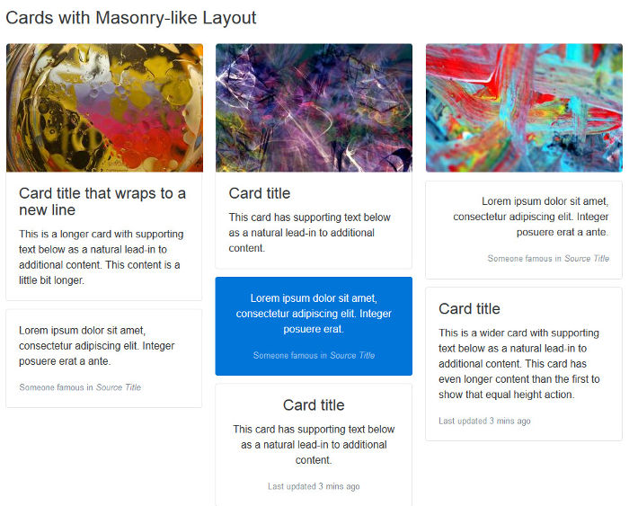

[//]: # (
template: chapter.pug
title: "Your First Week With Bootstrap"
chaptertitle: "Super Smart New Features to Win You Over"
chapterauthor: Maria Antonietta Perna
)

The [first stable release of Bootstrap 4](https://blog.getbootstrap.com/) is here. And it's pretty cool. This article looks at some of its best features.

It was on 19th August, 2015, that [Bootstrap 4 alpha](http://blog.getbootstrap.com/2015/08/19/bootstrap-4-alpha/) was finally out. This was after months of anticipation, anxious tweets asking for the disclosure of a release date, and a few scattered [scraps of news](https://twitter.com/mdo/status/591364406816079873) by [Mark Otto](http://markdotto.com/) and [Jacob Thornton](http://twitter.com/fat), having the effect of intensifying rather than quenching our curiosity. More than two years later, the wait for the first stable release is finally over.

As a designer, I love crafting my own CSS. However, I confess that I find Bootstrap a well thought out and strongly supported front-end framework that I’ve immensely enjoyed using — both for building my projects and for learning more about writing better, modular CSS.

As soon as news of the latest release was out, I downloaded the [source files for Bootstrap 4](http://getbootstrap.com/docs/4.0/getting-started/download/) and spent some time going back and forth between reading [the docs](http://getbootstrap.com/docs/4.0/getting-started/introduction/) and digging into the code to find out more.

Here are the latest Bootstrap features I like the most. I hope you find them awesome too!

#1 New Interactive Documentation
--------------------------------

The Bootstrap documentation has been exemplary since the framework’s early days. It’s always had the crucial role of being a _living document_ — that is, a tool in sync with the collaborative effort of building the framework and communicating it to others:

> Abstracting and documenting components became part of our process for building this one tool and Bootstrap in tandem. — _[Mark Otto in 2012](http://alistapart.com/article/building-twitter-bootstrap)_

Mark himself is quite a fan of great documentation. His [Code Guide by @mdo](http://codeguide.co/) is evidence of his attitude that high-quality documentation is part and parcel of writing high-quality code.

The documentation for version 4 has been rewritten from scratch using [Markdown](http://daringfireball.net/projects/markdown/), and its appearance has been revamped with a new layout, color palette, and the use of system fonts.

The Bootstrap docs:

* are a pleasure to navigate, both using the traditional sidebar navigation and the brand new **search form**
* structure information in a logical manner; content is never overwhelming or confusing
* include instructions and how-tos covering all areas of the framework, from different ways of installing Bootstrap to using each component and dealing with browser quirks.

Finally, if you’d like to run the Bootstrap docs locally on your computer, follow [these instructions](https://github.com/twbs/bootstrap/tree/v4-dev#documentation).

#2 Top-notch Modular Architecture
---------------------------------

Bootstrap has often been the target of complaints about code bloat, too opinionated CSS styling, and a profuse quantity of components. The good news is that Bootstrap 4 has both simplified and further modularized its structure.

To begin with, some components have been eliminated altogether. The [Glyphicons](http://glyphicons.com/) icon library is not bundled with the framework any more. Panels, wells, and thumbnails are replaced by the [Cards](http://getbootstrap.com/docs/4.0/components/card/) component. Also, all CSS reset/normalize code and basic styling are now dealt with in a single brand new module called [Reboot](http://getbootstrap.com/docs/4.0/content/reboot/).

It’s safe to say that, now more than ever before, using Bootstrap feels like assembling and arranging Lego blocks in different ways. Here are some examples to clarify what I mean.

### Easy-to-Override Variables

Bootstrap’s Sass variables use the `!default` flag, which makes it easy for you to override their values. Grab a copy of the latest release of Bootstrap [source files](http://getbootstrap.com/docs/4.0/getting-started/download/) and open `_variables.scss` in a code editor. Here are just three of the first variables you’ll come across:

```scss
$white:#fff !default;
$gray-100: #f8f9fa !default;
$gray-200: #e9ecef !default;
$gray-300: #dee2e6 !default;
```

These are color variables, which you can override by simply copying and pasting the variables to your own Sass file, changing the default value, and removing the `!default` flag. No need to mess with the original Bootstrap source code.

### Ready-made, Light-weight Versions

Besides `bootstrap.scss`, which includes the entire framework, you’ll also find `bootstrap-grid.scss` and `bootstrap-reboot.scss`.

Each of these files includes only _selected portions_ of Bootstrap. If you don’t need the full-blown framework in your project, this is a great head-start: just compile one of the light-weight options and you’re good to go.

Corresponding cut-down compiled packages are available for download from the Bootstrap 4 docs page.

### Reusable Components

You can skin and modify components by mixing and matching a few classes. For instance, the brand new [cards](https://getbootstrap.com/docs/4.0/components/card/) component is a great example of this versatility in action.

Here’s all the HTML you need for the simplest instance of this component:

```html
<div class="card">
 <div class="card-body">
   This is some text within a card body.
 </div>
</div>
```

This flexible component easily adapts to a variety of content types and layouts. For instance, you can also arrange cards in [touching equal width and height columns](http://getbootstrap.com/docs/4.0/components/card/#card-groups) by wrapping them in a `.card-group` container:

```html
<div class="card-group">
 <div class="card">
   <!-- card code here -->
 </div>
 <div class="card">
   <!-- card code here -->
 </div>
 <div class="card">
   <!-- card code here -->
 </div>
</div>
```


Alternatively, you can group cards having equal width and height [columns with margins](http://getbootstrap.com/docs/4.0/components/card/#card-decks), using the `.card-deck` class as follows:

```html
<div class="card-deck">
 <div class="card">
   <!-- card code here -->
 </div>
 <div class="card">
   <!-- card code here -->
 </div>
 <div class="card">
   <!-- card code here -->
 </div>
</div>
```


Another cool thing you can do with cards is build a [Masonry](http://masonry.desandro.com/)\-like layout. Just wrap the cards in a [container](http://getbootstrap.com/docs/4.0/components/card/#card-columns) with the `.card-columns` class and leave the rest to Bootstrap:

```html
<div class="card-columns">
 <div class="card">
   <!-- card code here -->
 </div>
</div>
```



Here I’ve offered only a few examples of Bootstrap’s modular architecture. I think these suffice to show how flexibility and extensibility are built into the framework as a whole, which makes it fun and convenient to use.

#3 Easier Scaling Across Screen Sizes
-------------------------------------

Since version 3, Bootstrap has introduced a **mobile-first** approach to web design. That is, start developing for smaller screens first and progressively add or adjust features as you target larger screens.

Version 4 makes further improvements towards adaptive web design by taking the following steps.

### The Introduction of a Flexbox-based Grid System

Bootstrap now uses [Flexbox](https://www.w3.org/TR/css-flexbox-1/) to build its [grid system](http://getbootstrap.com/docs/4.0/layout/grid/).

Since Flexbox is natively _flexible_, coding a responsive page layout is going to require fewer classes. For instance, to achieve a layout with three columns side by side on larger screens and stacked on top of each other on small screens, just add the `col-sm` class to each column div:

```html
<div class="container">
 <div class="row">
   <div class="col-sm">
 One of three columns
   </div>
   <div class="col-sm">
 One of three columns
   </div>
   <div class="col-sm">
 One of three columns
   </div>
 </div>
</div>
```

### The Move to `rem`

Where earlier versions of Bootstrap set `px` as the absolute unit of measurement, version 4 mostly uses the relative units `rem` and `em`. The goal is to have all elements on a web page harmoniously scale with the screen size.

For instance, if you dig into `_variables.scss`, you’ll see that `$font-size-base` is set to `1rem`, which assumes the browser’s default `font-size` (usually equivalent to `16px`). Bootstrap uses this variable’s value to set the `font-size` for the document’s `<body>` (see \_reboot.scss).

This means that it’s easier to build web pages where all elements proportionally scale up or down with the screen size without messing up your design.

### Here Comes the Extra-large Breakpoint

The introduction of the new _extra large breakpoint_ for the grid system further helps building layouts that scale well across different screen sizes.

This breakpoint is applied using the `.col-xl-` class and is triggered on screen sizes from `1200px` upwards.

### Global Margins Reset and Utility Spacer Classes

Forcing consistent spacing between elements in a design is something most front-end developers, including myself, obsess over. It’s a tricky task and the plethora of screen resolutions available doesn’t make the job easier.

To help keep both vertical and horizontal spacing between elements under tight control, Bootstrap 4 resets `margin-top` to `0` while keeping a consistent `margin-bottom` value on all elements.

Further, the framework offers an impressive number of [utility classes](http://getbootstrap.com/docs/4.0/utilities/spacing/) to make it easier for you to adjust margins and paddings at a more granular level across varying screen sizes.

